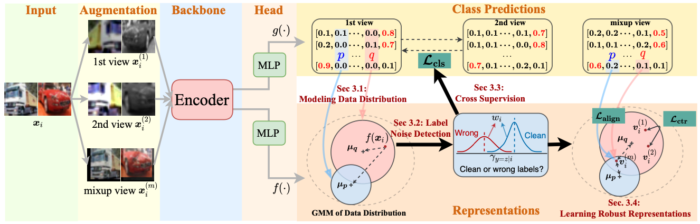
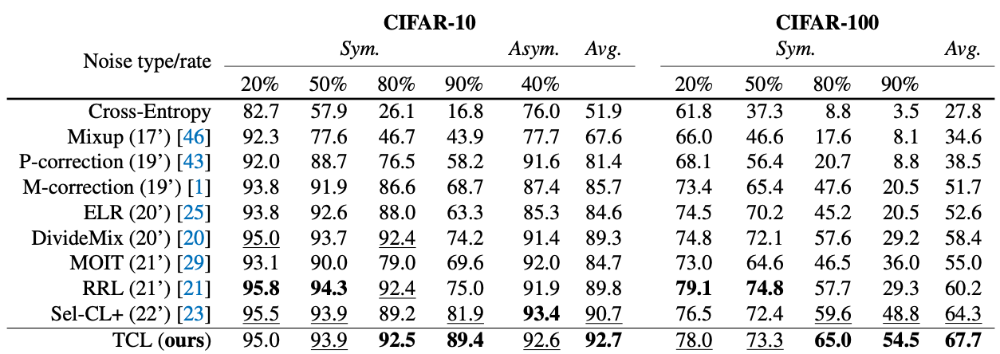

## Twin Contrastive Learning with Noisy Labels

This repo provides the official PyTorch implementation of our [TCL](https://arxiv.org/abs/2303.06930) accepted by **CVPR 2023**.

We have built new state-of-the-art performance on several benchmarked datasets.

> Twin Contrastive Learning with Noisy Labels <br>
> https://arxiv.org/abs/2303.06930 <br>
> Abstract: Learning from noisy data is a challenging task that significantly degenerates the model performance. In this paper, we present TCL, a novel twin contrastive learning model to learn robust representations and handle noisy labels for classification. Specifically, we construct a Gaussian mixture model (GMM) over the representations by injecting the supervised model predictions into GMM to link label-free latent variables in GMM with label-noisy annotations. Then, TCL detects the examples with wrong labels as the out-of-distribution examples by another two-component GMM, taking into account the data distribution. We further propose a cross-supervision with an entropy regularization loss that bootstraps the true targets from model predictions to handle the noisy labels. As a result, TCL can learn discriminative representations aligned with estimated labels through mixup and contrastive learning. Extensive experimental results on several standard benchmarks and real-world datasets demonstrate the superior performance of TCL. In particular, TCL achieves 7.5% improvements on CIFAR-10 with 90% noisy label -- an extremely noisy scenario.

**If you found this code helps your work, do not hesitate to cite my paper or star this repo!**

### Introduction

The detail implementations and the results can be found in `models/tcl`, and in the following table 2, respectively.

##### EM Framework



##### Main Results



### Training

#### Install requirements
```shell
git clone --depth 1 https://github.com/Hzzone/torch_clustering tmp && mv tmp/torch_clustering . && rm -rf tmp
```

```shell
pip install -r requirements.txt
```

#### Training Commands
The config files are in `models/tcl/configs/`, just run the following command:
```shell
export CUDA_VISIBLE_DEVICES=0,1,2,3 # use the first 4 GPUs
torchrun --master_port 17675 --nproc_per_node=4 main.py models/tcl/configs/cifar100_90_prer18.yml
```

We can also enable the WANDB to visualize the training!

Set the `wandb` parameters to true, and login to wandb.ai:
```shell
wandb login xxx
```

#### Download the pretrained models and training logs

The pretrained models can be saved by setting `save_checkpoints` to `true`.

Some training logs can be found in:
* [Google Drive](https://drive.google.com/drive/folders/1pOA5UPD4jiccW6ySDJqmJj3i6uph00nf?usp=sharing)
* [Baidu Disk](https://pan.baidu.com/s/1_K1PdFue9FtFXO2wbCzuBg?pwd=uhpe)

### Citation

If you found this code or our work useful please cite us:

```bibtex
@inproceedings{huang2023twin,
  title={Twin Contrastive Learning with Noisy Labels},
  author={Huang, Zhizhong and Zhang, Junping and Shan, Hongming},
  booktitle={CVPR},
  year={2023}
}
```
